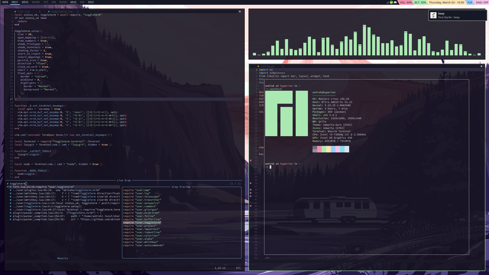

# Dotfiles (Ashish Shenoy)

Here's how this looks right now:

 

The programs whose dotfiles I'm currently tracking are:

- alacritty
- bash
- dunst
- git
- mpv
- neovim
- picom
- qtile
- rofi
- vscode
- zsh

I'm currently using a [Git bare repository](https://www.atlassian.com/git/tutorials/dotfiles) to manage my dotfiles.

I've used [GNU Stow](http://brandon.invergo.net/news/2012-05-26-using-gnu-stow-to-manage-your-dotfiles.html) before to manage my dotfiles, but I've had problems with symlinks everywhere and the directory structure wasn't as clean as I would've liked. So I've migrated to a Git bare repository.
